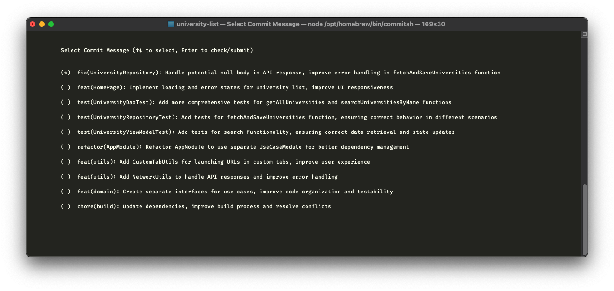
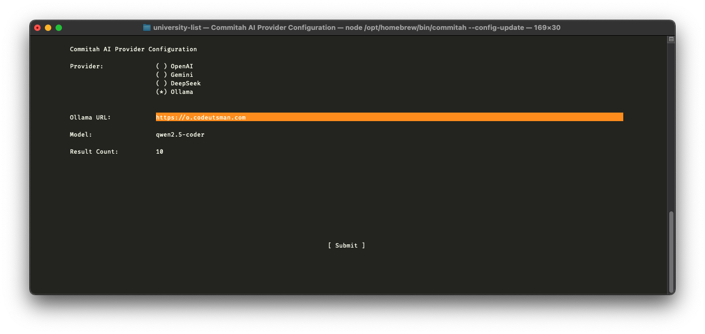

# Commitah CLI

A powerful Command Line Interface (CLI) tool that leverages AI to generate meaningful and standardized Git commit messages. Commitah analyzes your staged changes and provides contextual commit message suggestions following conventional commit standards.

## Features

- 🤖 **AI-Powered Messages**: Generates commit messages by analyzing git diff using various AI providers
- 🎨 **Interactive UI**: User-friendly CLI interface for selecting commit messages
- ⚙️ **Multiple AI Providers**: Supports OpenAI, Gemini, DeepSeek, and Ollama
- 🔧 **Configurable**: Customize message specifications and provider settings
- 📝 **Conventional Commits**: Follows standardized commit message format

| Commit selection v2 |
| ---- |
|  |

| AI Provider on configuration v2 |
| ---- |
|  |

## Prerequisites

- Node.js v16 or later
- Git installed and available in PATH
- API key from your chosen AI provider (OpenAI, Gemini, DeepSeek) or Ollama running locally

## Installation

```bash
npm install --global commitah
```

## Usage

Basic usage:
```bash
# Stage your changes first
git add .

# Generate commit message
commitah
```

Available options:
```bash
# Show current configuration
commitah --config

# Update configuration
commitah --config-update

# Preview commit message without committing
commitah --show
```

## Configuration

Configuration is stored in `~/.commitahconfig-v2`. The tool will create a default configuration on first run. <br> You can update the configuration using the `--config-update` option.

Example configuration:
```json
{
  "provider": "OpenAI",
  "providerApiKey": "your-api-key",
  "providerUrl": "https://api.openai.com/v1",
  "messageSpec": "conventional commit",
  "sizeOption": 3,
  "model": "gpt-4-turbo-preview"
}
```

### Supported Providers

- **OpenAI**: Uses GPT models
- **Gemini**: Uses Google's Gemini models
- **DeepSeek**: Uses DeepSeek's language models
- **Ollama**: Uses locally hosted models

## Ollama Setup Instructions

1. First, install Ollama on your system following the instructions at [Ollama's official website](https://ollama.ai)

2. Pull the **recommended models**:
```bash
# Pull Qwen2.5 Coder
ollama pull qwen2.5-coder

# Pull Dolphin 3
ollama pull dolphin3

# Pull Gemma 2B
ollama pull gemma:2b
```

3. Configure Commitah to use Ollama:
```bash
commitah --config-update
```
Then:
- Select 'Ollama' as the provider
- Enter your Ollama URL (default: http://localhost:11434)
- Select one of the recommended models:
  - qwen2.5-coder (Recommended for best code understanding)
  - dolphin3 (Good balance of speed and accuracy)
  - gemma:2b (Lightweight option)

Note: Ensure Ollama is running before using Commitah with these models.

## How It Works

1. Analyzes staged changes using `git diff`
2. Sends the diff to the configured AI provider
3. Generates multiple commit message suggestions
4. Presents an interactive UI to select the preferred message
5. Creates the commit with the selected message

## Development

To build from source:

```bash
# Clone the repository
git clone [repository-url]

# Install dependencies
npm install

# Build the project
npm run build
```

## License

ISC License

## Author

Muhammad Utsman